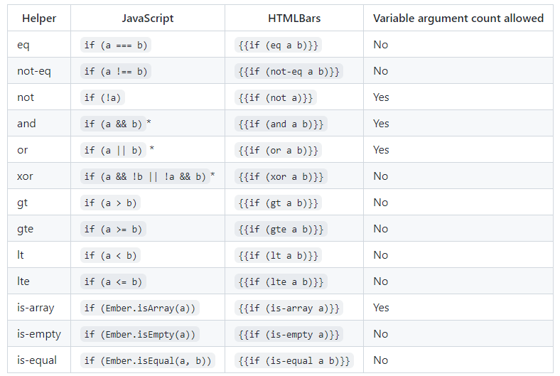

# LEARN-EMBER
https://emberjs.com/learn/

- ember-concurrency
- ember-auto-import (absolute vereiste)
- ember-truth-helpers (absolute vereiste) 
- ember-cli-string-helpers
- ember-composable-helpers
- ember-data-storefront (dit neemt heel veel complexiteit van ember-data weg)
- ember-cli-mirage (voor testing)

+ Data down actions up
+ Dependency Injection & Services
+ Glimmer components via de import @glimmer/component (niet kijken naar @ember/component, die zijn deprecated en gebruiken we niet meer)
+ Algemeen in Javascript: Async/Await en Promises (snap goed het verschil tussen synchroon en asynchroon, het helpt als je de Event Loop in Javascript begrijpt)

# Notes
## ember
hbs - Handlebars Basic

argument met @ = Ember
attribute zonder @ = html

Ember-cli: ember serve duurt echt lang

## ember-concurrency
Tasks met state etc > loading indicators etc...
http://ember-concurrency.com/docs/tutorial/refactor

## ember-auto-import
Just install

## ember-truth-helpers
Better if statements
  

## ember-cli-string-helpers
capitalize, camelize, html-safe... strings

https://github.com/romulomachado/ember-cli-string-helpers

## ember-composable-helpers
Lots of helpers

## ember-data-storefront (dit neemt heel veel complexiteit van ember-data weg)

## ember-cli-mirage (voor testing)

## @glimmer/component
Standaard?